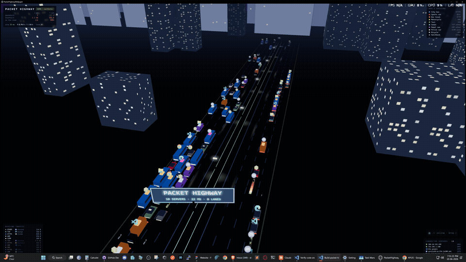

# Packet Highway

**Your network traffic, rendered as rush hour.** Every packet leaving or
entering your PC becomes a vehicle on a 3D night highway — running live
**behind your desktop icons** as a Windows wallpaper. HTTPS rides the bus,
QUIC drives a sports car, DNS zips by on a motorcycle, and a ping is a police
car. The app that sent the packet floats above the roof as its icon.

No installs, no dependencies, no admin (in demo mode) — it's built entirely
from what already ships with Windows: `pktmon`, the .NET C# compiler, and
Microsoft Edge.



*Real recording of the wallpaper running behind the desktop icons —
[higher-quality MP4](media/demo.mp4), or a [still](media/screenshot.png).*

**[▶ Live demo in your browser](https://shakeebshaan.github.io/packet-highway/)** —
synthetic traffic, nothing is captured. Drag to orbit, scroll to zoom, click a
car to inspect the packet.

> Idea sparked by [this tweet by @BijanBowen](https://x.com/bijanbowen/status/2064473191163035814)
> ("Had Claude Fable 5 log network packets and display them as cars on a
> highway"). This is an independent open-source implementation, built with
> Anthropic's Claude Fable 5.

## Quick start (Windows 10/11)

```bat
git clone https://github.com/shakeebshaan/packet-highway.git
cd packet-highway
start.bat
```

| Script | What it does |
| --- | --- |
| `start.bat` | Live capture wallpaper. Asks for admin once (pktmon needs it), builds on first run, starts the server, pins the highway behind your desktop icons. |
| `start-demo.bat` | No admin. Synthetic traffic in a normal browser tab — good for trying it out. |
| `stop.bat` | Removes the wallpaper, stops capture and the server. |

Browser mode (open `http://localhost:8339/` while the server runs): drag to
orbit, scroll to zoom, click a car to inspect the packet (protocol, app,
addresses, size). The wallpaper itself is non-interactive by design — desktop
windows don't receive mouse input.

## Who's driving

| Vehicle | Protocol | | Vehicle | Protocol |
| --- | --- | --- | --- | --- |
| City bus (blue) | HTTPS | | Panel van (purple) | UDP other |
| Sports car (red) | QUIC | | Police car (white) | ICMP ping |
| Box truck (orange) | HTTP | | Bicycle (light gray) | ARP |
| Motorcycle (yellow) | DNS | | Hatchback (gray) | Other |
| Taxi (green) | SSH | | Sedan (cyan) | TCP other |

**App logos:** packets are attributed to the owning process (local port →
PID via the Windows TCP/UDP tables). The app's icon is extracted from its exe
and floats above the vehicle; the app name also shows in the passing-traffic
log and the click-to-inspect card.

## Privacy & security

- **Metadata only.** Protocol, ports, addresses, sizes, owning process. Packet
  payloads are never inspected, stored, or displayed.
- **Local only.** The server binds to `127.0.0.1`. No telemetry, no analytics.
  Nothing about your traffic ever leaves the machine.
- **One exception, disclosed:** the sky matches your real weather. On startup
  the backend asks `ip-api.com` for a coarse lat/lon (standard web request —
  your IP is all it sees) and `open-meteo.com` for current precipitation.
  That's the only outbound traffic, and no capture data is ever included.
- **The hosted demo captures nothing.** It synthesizes fake traffic
  client-side in your browser.
- **Auditable.** The whole backend is one dependency-free C# file you can read
  before running. Found something? See [SECURITY.md](SECURITY.md).

Admin is required only for live capture (`pktmon` is an elevated-only Windows
component); demo mode runs unprivileged.

## How it works

- `PacketHighway.exe` (built from `PacketHighway.cs` by `build.bat`) runs
  `pktmon start --capture --comp nics --log-mode real-time`, parses the
  stream, classifies by protocol/port, attributes to processes, and serves
  the frontend + a Server-Sent-Events stream on `localhost:8339`.
- `web/` is the Three.js scene (vendored locally, works offline). On static
  hosting (GitHub Pages / `file://` / `?static=1`) it switches to a built-in
  synthetic traffic generator — same event shapes, no backend.
- `wallpaper.ps1` opens an Edge `--app` window and re-parents it into the
  desktop's WorkerW layer (the layer between the wallpaper and your icons).
  Handles both the classic layout and the Windows 11 24H2 layout.

## Performance / eco mode

The wallpaper runs at 30 fps with a capped pixel ratio and a 220-car limit.
Packet sampling kicks in automatically during traffic spikes (the `100%`
figure in the dashboard shows the sampled share). For a lighter mode add
`&eco=1` to the URL in `start.bat` / `wallpaper.ps1`: 24 fps, fewer
buildings, 50-car cap.

## Multi-monitor

By default the wallpaper covers the **primary monitor only** (best framerate,
HUD laid out correctly). To stretch one scene across every monitor:
`powershell -File wallpaper.ps1 -Span`. The script is per-monitor-DPI aware,
so scaled and mixed-DPI setups place correctly.

## Notes

- If the badge shows `NO CAPTURE — run as admin`, the server wasn't elevated;
  use `start.bat` (it self-elevates) — it falls back to demo traffic otherwise.
- After a display-resolution change Windows may rebuild the desktop layers;
  just run `start.bat` again.
- QUIC is detected as UDP/443, HTTPS as TCP/443, DNS as port 53, SSH as 22.

## Contributing & license

PRs welcome — see [CONTRIBUTING.md](CONTRIBUTING.md). The project is
deliberately zero-dependency; please keep it that way.

[MIT](LICENSE) © Shaan Shaik
